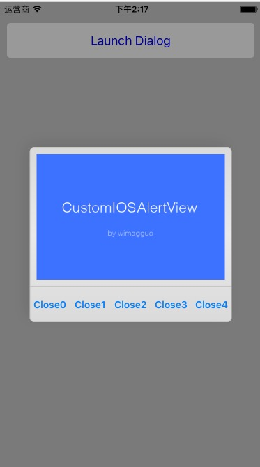

# CustomAlertView
CustomAlertView，可以在自定义View上放控件。

<!--屏幕截图:-->
<!---->

`v0.9.3`

<!--`support for both iOS7 and iOS8`-->

<!--The addSubview is not available in UIAlertView in iOS7 or iOS8 any more. The view hierarchy for this class is private and must not be modified.-->
<!---->
<!--As a solution, this class creates an iOS-style dialog which you can extend with any UIViews or buttons. The animations and the looks are copied too and no images or other resources are needed.-->



<!--## Install-->

<!--As simple as adding the following files to your project:-->
<!---->
<!--* CustomIOSAlertView.h-->
<!--* CustomIOSAlertView.m-->
<!---->
<!--Or use Cocoapods:-->
<!---->
<!--```-->
<!--pod 'CustomIOSAlertView', '~> 0.9.3'-->
<!--```-->
<!---->
<!--## Change notes-->
<!---->
<!--* Fixed rotation for IOS8-->
<!---->
<!--* Removed 7 from the class name. Just use CustomIOSAlertView from now on, like: [[CustomIOSAlertView alloc] init];-->
<!---->
<!--* The initWithParentView method is now deprecated. Please use the init method instead, where you don't need to pass a parent view at all. **In case the init doesn't work for you, please leave a note or open an issue here.**-->
<!---->
<!--## Quick start guide-->
<!---->
<!--1. Create the UIView object `changed`-->
<!---->
<!--```-->
<!--CustomIOSAlertView *alertView = [[CustomIOSAlertView alloc] init];-->
<!--```-->
<!---->
<!--2. Add some custom content to the alert view (optional)-->
<!---->
<!--```-->
<!--UIView *customView ..;-->
<!---->
<!--[alertView setContainerView:customView];-->
<!--```-->
<!---->
<!--3. Display the dialog-->
<!---->
<!--```-->
<!--[alertView show];-->
<!--```-->
<!---->
<!--## More functions-->
<!---->
<!--* Close the dialog-->
<!---->
<!--```-->
<!--[alertView close];-->
<!--```-->
<!---->
<!--* To add more buttons, pass a list of titles-->
<!---->
<!--```-->
<!--[alertView setButtonTitles:[NSMutableArray arrayWithObjects:@"Button1", @"Button2", @"Button3", nil]];-->
<!--```-->
<!---->
<!--* You can remove all buttons by passing nil-->
<!---->
<!--```-->
<!--[alertView setButtonTitles:NULL];-->
<!--```-->
<!---->
<!--* You can enable or disable the iOS7 parallax effects on the alert view-->
<!---->
<!--```-->
<!--[alertView setUseMotionEffects:TRUE];-->
<!--```-->
<!---->
<!--* Handle button clicks with a custom delegate-->
<!---->
<!--First, set the delegate:-->
<!---->
<!--```-->
<!--[alertView setDelegate:self];-->
<!--```-->
<!---->
<!--Then add the delegate methods:-->
<!---->
<!--```-->
<!--- (void)customIOS7dialogButtonTouchUpInside: (CustomIOSAlertView *)alertView clickedButtonAtIndex: (NSInteger)buttonIndex-->
<!--{-->
<!--NSLog(@"Button at position %d is clicked on alertView %d.", buttonIndex, [alertView tag]);-->
<!--}-->
<!--```-->
<!---->
<!--* Handle button clicks with a code block-->
<!---->
<!--```-->
<!--[alertView setOnButtonTouchUpInside:^(CustomIOSAlertView *alertView, int buttonIndex) {-->
<!--NSLog(@"Block: Button at position %d is clicked on alertView %d.", buttonIndex, [alertView tag]);-->
<!--[alertView close];-->
<!--}];-->
<!--```-->
<!---->
<!--You can also disable all other delegates by:-->
<!---->
<!--```-->
<!--[alertView setDelegate:self];-->
<!--```-->
<!---->
<!--## Todos-->
<!---->
<!--This is a really quick implementation, and there are a few things missing:-->
<!---->
<!--* Adding more buttons: they don't exactly match the look with that of on iOS7-->
<!---->
<!--* Rotation: rotates wrong with the keyboard on-->

